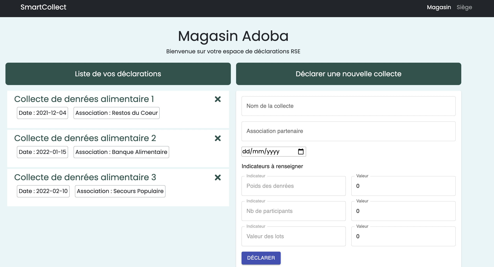
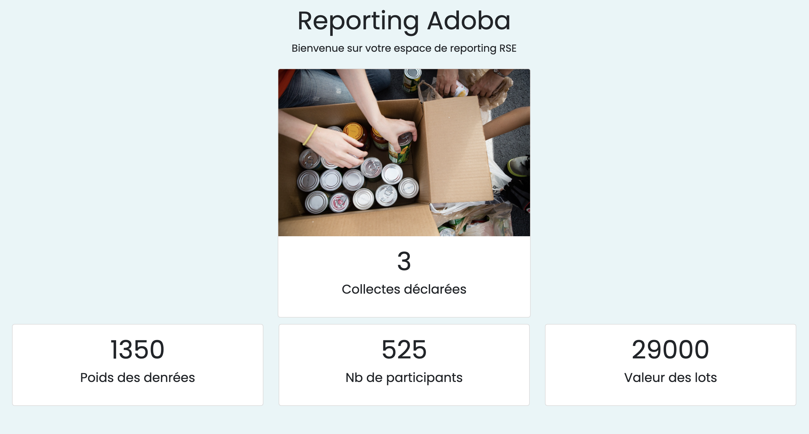
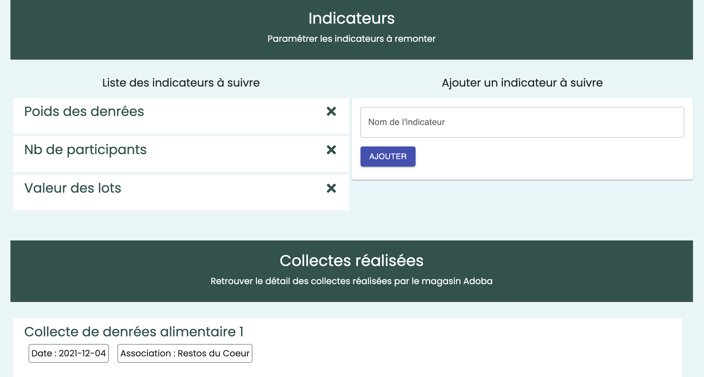

# SmartCollect app

This project was bootstrapped with [Create React App](https://github.com/facebook/create-react-app) and Rails backend API using this [template](https://github.com/lewagon/rails-templates)

### About this project

SmartCollect app is a food collection reporting app for store manager and corporate social responsibility manager (CSR manager)

### Built With

- Ruby on Rails (ruby '2.7.4' and rails '~> 6.1.4') with PostgreSQL database
- React (useEffect, useLocation, useState hooks and react-router-dom)

Libraries used for the react project:
- Formik
- Boostrap
- Material UI
- yup

## Getting Started
### Installation
1. Backend api is located in another repo: [smart-collect api](https://github.com/CamilleBreillot/smart-collect-api).
- First clone the [smart-collect api](https://github.com/CamilleBreillot/smart-collect-api) repo to your desktop
```sh
gh repo clone CamilleBreillot/smart-collect-api
   ```
- Navigate to the smart-collect-api folder
 ```sh
   cd smart-collect-api
   ```
- Install all dependencies needed for the Rails API:
 ```sh
   bundle install
   ```
 - Create database, run migrations and build seed
 ```sh
   rails db:create db:migrate db:seed
   ```
- Start server (it will run on localhost:3000):
 ```sh
   rails s
   ```
2. Then clone the [current repo](https://github.com/CamilleBreillot/smart-collect-app) to your desktop (SPA React app is located in this folder)
```sh
gh repo clone CamilleBreillot/smart-collect-app
   ```
- Navigate to the smart-collect-app folder:
 ```sh
   cd smart-collect-app
   ```
- Install all dependencies needed for the react app:
 ```sh
   npm install
   ```
- Start server (it will run on localhost:2000, the API server should still be running in a different terminal tab, using Port 3000)
 ```sh
   npm start
   ```
- Open [http://localhost:2000](http://localhost:2000) to view it in your browser.

## Features
App has 2 pages :
**1. One for the store manager of Adoba where he can:**
- See the list of his food collections 
- Delete food collection
- Add a food collection with indicators that are set by the CSR manager of Adoba (see section on national page below)



**2. A second page for the CSR manager where he can:**
- See the main statistic on food collection added by Adoba (reporting section)
  - Number of collects
  - Statistics on weight, number of participants and value of collects (those 3 indicators are setup in the seed)
  - When the CSR manager added new indicator to track, the indicator is automatically added to the reporting (new card is created). Values of indicators in reporting gets updated automatically when a new food collection is added by Adoba's store manager
- See the indicators list to be track when a food collection is declared
- Add a new indicator to be tracked (form). The indicator is automatically added to the collection form on the Adoba store page and to the reporting
- Remove an indicator from the list. The indicator is automatically removed from the collection form on the Adoba store page and from the reporting
- See the detailed list of food collection declared by Adoba (with name and association)





## Choices made

- **Modelling the data**: I choose to have 3 different models: collection, indicators and fields. I also created a user model but model is not used in this app as there is no authentification logic. Field was created to handle the additional indicator to track for food collection. Collection has a one to many relationship with indicators.
- **Data** is fetched from an Rails API backend. I used Fetch API for its ease of use (coupled with the UseEffect hook). A seed is setup with 3 collections, 9 indicators (3 for each collections) and 3 fields (indicators to track).
- **Component tree**:
  - App:
    - Navbar
    - Store:
      - Header
      - CollectList:
        - Collect
      - CollectForm:
        - Formik components
    - National:
      - Header
      - Statistics
      - Subheader
      - FieldList:
        - Field
      - IndicatorForm
      - Subheader
      - CollectList:
        - Collect
  Components are reused throughout the app (CollectList for ex)
- **State management**: I choose to manage state using the UseState hook as this is a simple app. State is also managed with Formik in the forms
- **Forms management**: I choose to create forms with Formik to create forms more easily especially the CollectForm which has dynamic fields based on JSON data (fetched from the index of the field resource). Yup was used to handle form validation.
- **Store page**: page is quite simple with 2 main sections: collection list and form to add a collect. Validation is implemented. User has to enter all fields to validate the declaration.
- **National page**: page starts with the dashboard where key indicators are reported and automatically recalculated when a new food collection is added. Then, there is the indicator setup section where the CSR manager can choose which indicator to track. Indicator is automatically added to form and dashboard. I also added the possibility to delete an indicator. Finally, the CSR manager can find the details of the collection added by the store owner. Delete option is disabled.
- **CSS**: I choose to use bootstrap and Material UI to create a simple interface.
- **Responsiveness**: app is developed for desktop only

## Improvements examples:
- **Authentification** with signup and signin page should be added. Token for API is implemented but not used (so a user can only delete collection that he created for ex)
- **Authorization** should be implemented with pundit gem. So a store owner and a CSR manager have different access (store owner will not be able to access national page and add indicators for ex)
- **State management**: Context API or Redux should be used to handle state
- **CRUD not complete**: not all CRUD actions are implemented. A user can't update a food collection or a indicator
- **Forms**: 
  - UI should be better, especially on dynamic fields. Currently field is grayed so store manager can't edit field but a better soluton could be found. Dropdown menu should be added for association
  - Submit button to optimize (transition is too quick)
  - User should be able to enter start and end date
  - User should have the possibility to add a photo
  - Food collection should not be added instantly but a validation should be necessary from the national
- **Reporting**:
  - Graphics should be added for better readability of indicators
  - Filters capabilities should be added to filter indicators by store for ex
- **Adding new indicators**: a better approach could be found to add new indicators to be tracked. Dynamic fields could be better handled.
- **Mobile responsive**: app should be mobile responsive
- **CSS**: Css is of course very basic :)

